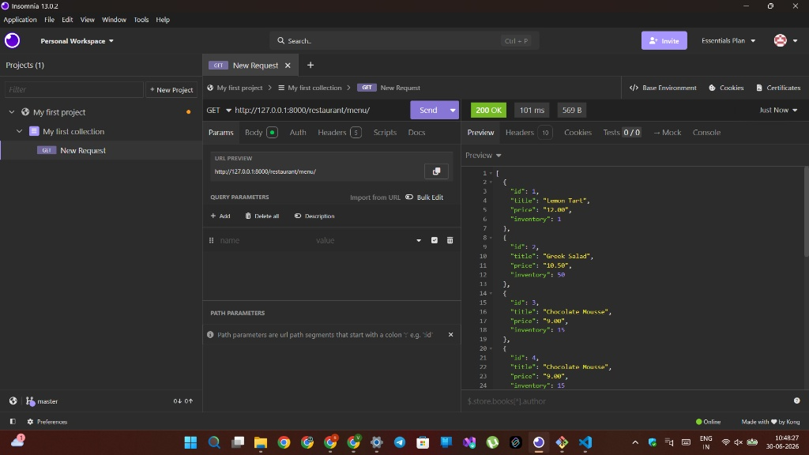
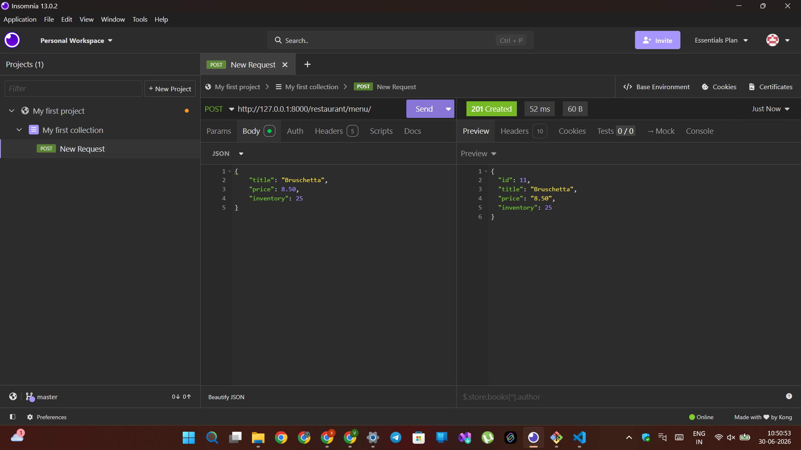
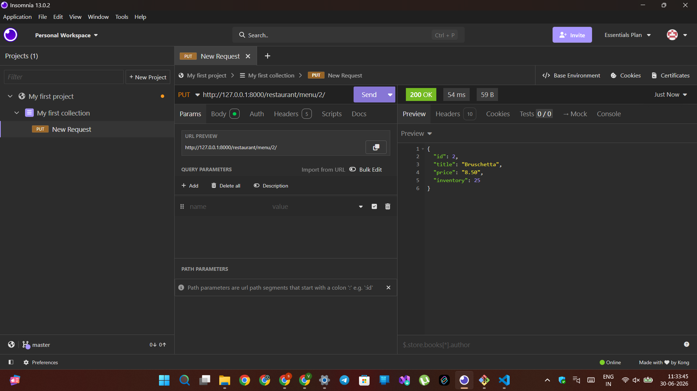
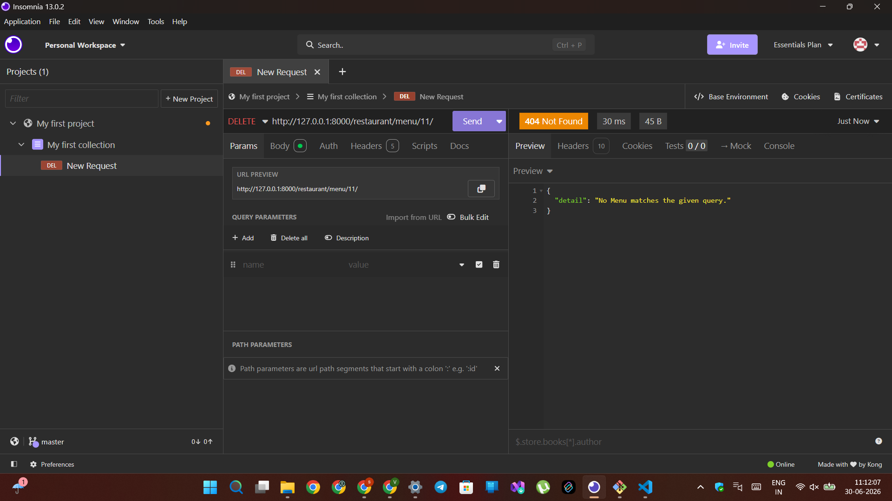
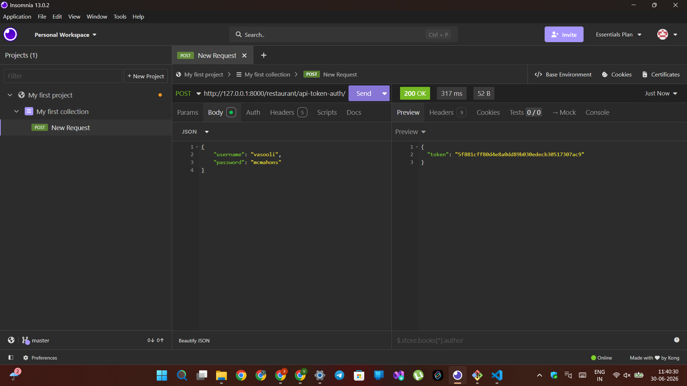
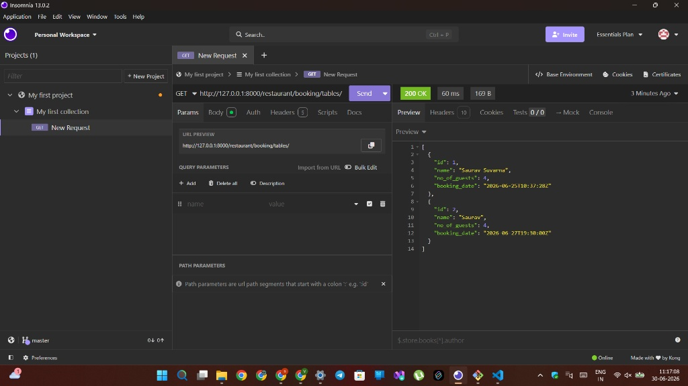
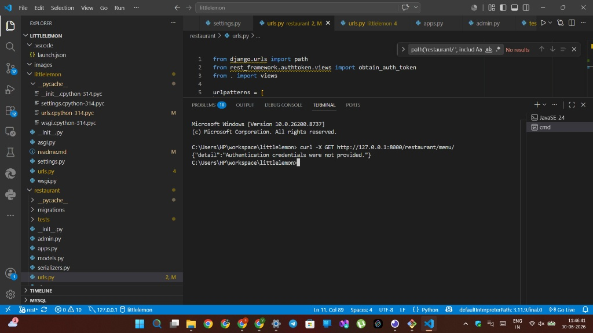
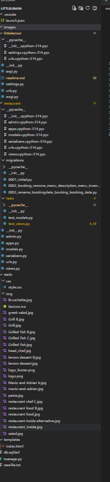

# 🍋 Little Lemon Restaurant API


## Meta Back-End Developer Professional Certificate
### Back-End Developer Capstone (Coursera)

**Developer:** Saurav Suresh Suvarna

---

# Table of Contents
- Project Overview
- Objectives
- Features
- Technology Stack
- Project Structure
- Installation
- Web Browser URLs
- API Endpoints
- Testing
- Project Screenshots
- Learning Outcomes
- Future Enhancements
- Author

---

# Project Overview

Little Lemon Restaurant API is a RESTful backend application developed using **Django**, **Django REST Framework**, and **MySQL**. It implements CRUD operations for menu items, protected booking APIs using DRF Token Authentication, unit testing, and API testing using **Postman**, **Insomnia**, and **cURL**.

# Objectives

- Build RESTful APIs
- Implement CRUD operations
- Integrate MySQL
- Secure endpoints using DRF Token Authentication
- Test APIs using Postman, Insomnia, cURL, and Django Unit Tests

# Features

- Menu CRUD
- Booking API
- Token Authentication
- Django Admin
- MySQL Integration
- Unit Testing
- RESTful API
- JSON Request & Response

# Technology Stack

- Python
- Django
- Django REST Framework
- MySQL
- Git & GitHub
- Postman
- Insomnia
- cURL

# Project Structure

```text
LITTLELEMON/
├── littlelemon/
│   ├── __init__.py
│   ├── asgi.py
│   ├── settings.py
│   ├── urls.py
│   └── wsgi.py
├── restaurant/
│   ├── migrations/
│   ├── tests/
│   ├── admin.py
│   ├── apps.py
│   ├── models.py
│   ├── serializers.py
│   ├── urls.py
│   └── views.py
├── templates/
│   └── index.html
├── db.sqlite3
└── manage.py
```

# Installation

```bash
git clone https://github.com/dvloperhol8701/little-lemon
cd LittleLemon
python -m venv venv
venv\Scripts\activate
pip install -r requirements.txt
python manage.py makemigrations
python manage.py migrate
python manage.py createsuperuser
python manage.py runserver
```

# Web Browser URLs

- Home: http://127.0.0.1:8000/
- Menu: http://127.0.0.1:8000/restaurant/menu/
- Booking: http://127.0.0.1:8000/restaurant/booking/tables/
- Token: http://127.0.0.1:8000/restaurant/api-token-auth/
- GitHub: https://github.com/Sunilradhe/LittleLemon

# API Endpoints

| Method | Endpoint |
|---|---|
| GET | /restaurant/menu/ |
| GET | /restaurant/menu/<int:pk> |
| POST | /restaurant/menu/ |
| PUT | /restaurant/menu/<int:pk> |
| DELETE | /restaurant/menu/<int:pk> |
| POST | /restaurant/api-token-auth/ |
| GET | /restaurant/booking/tables/ |

# Testing

The APIs were successfully tested using:

- ✅ Postman
- ✅ Insomnia
- ✅ cURL
- ✅ Django Unit Tests

# Project Screenshots

## Unit Testing


## Menu API


## Create Menu


## Update Menu


## Delete Menu


## Token Generation


## Booking API


## cURL Output


## Project Structure


# Learning Outcomes

- REST API Development
- Django REST Framework
- CRUD Operations
- Token Authentication
- MySQL Integration
- API Testing
- Git & GitHub

# Future Enhancements

- JWT Authentication
- Pagination
- Search & Filtering
- Swagger / OpenAPI
- Docker
- CI/CD

# Author

**Saurav Suresh Suvarna**

Meta Back-End Developer Professional Certificate (Coursera)

GitHub: https://github.com/dvloperhol8701

# License

Developed for educational purposes as part of the Meta Back-End Developer Professional Certificate Capstone.
